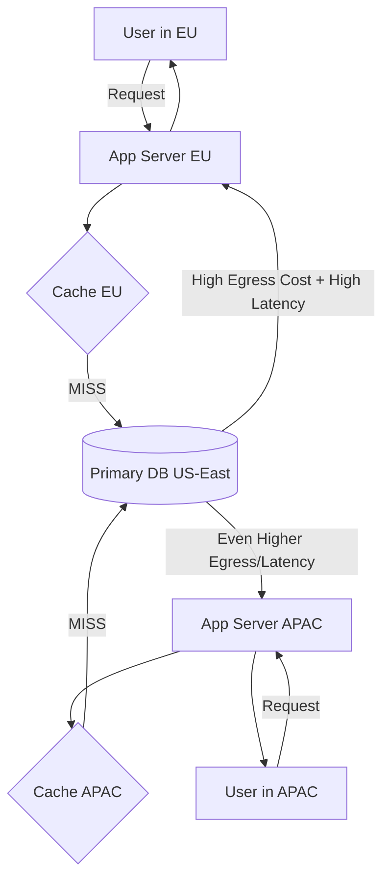

You know the feeling. It’s 3 AM, the pager goes off. The dashboard is a sea of red. Users in Singapore are reporting timeouts, the Paris analytics pipeline is crawling, and the finance team just forwarded you a cloud bill with a line item so large it looks like a typo: **$127,842.17 for Data Egress.**

This isn't a hypothetical. It's the new reality of global-scale applications. We’re no longer just serving a single region; we’re in a perpetual tug-of-war with physics and economics. On one side, the insatiable demand for low-latency, real-time data access across continents. On the other, the staggering, often unpredictable cost of moving that data across cloud provider networks—a cost that scales linearly with success.

For years, the playbook was simple: replicate everything, everywhere. Deploy regional caches (Redis, Memcached), use CDNs for static assets, and pray your cloud provider’s backbone is having a good day. But this is a blunt instrument. It’s expensive, inefficient, and still leaves you vulnerable to the latency spikes of a cache miss that traverses an ocean.

The breakthrough—the one that let us cut that $127k bill by over 70% while _improving_ p99 latency—didn't come from a new managed service. It came from rethinking the network itself. By moving intelligence from the server to the switch, and orchestrating our caching layer not as dumb storage, but as a predictive, topology-aware mesh.

This is the story of how we weaponized **programmable data planes** and **smart caching topologies** to win the cross-continental data war.

## The Anatomy of the Problem: More Than Just Bandwidth Bills

First, let's dissect the monster. "Cross-continental data egress" sounds like a simple bandwidth tax. It's far more nuanced.

1.  **The Toll Road Model:** Cloud providers essentially charge you a toll every time data leaves their "city" (region) and travels on their "highways" (backbone network) to another city or to the public internet. The rates are asymmetrical and punishing. Egress from US-East to Europe can be $0.02/GB, but from Australia to South America? That can be 5x higher. A single 1 PB analytics transfer can generate a five-figure invoice overnight.
2.  **Latency is a Distribution, Not a Number:** You don't experience "200ms latency." You experience a distribution. The mean might be 200ms, but the p99 can be 600ms due to congestion, route flapping, or a submarine cable having a bad hair day. This tail latency murders user experience and causes cascading failures in distributed systems.
3.  **The Cache Coherency Nightmare:** To reduce latency and egress, you cache. But now you have 12 Redis clusters around the world. How do you invalidate an entry in Tokyo when it's updated in Virginia? Do you use a pub/sub system that itself has cross-continental latency? You've traded one problem for another: stale data.

Our old architecture looked like this, and it was hemorrhaging money and performance:



_Every cache miss was a costly, slow transoceanic round-trip._

## Phase 1: The Smart Cracking Topology - From Trees to Meshes

The first insight was that our caching topology was dumb. It was a classic "star" topology, with each regional cache talking directly to the primary database. We needed our caches to talk to each other intelligently.

We moved to a **mesh topology with hierarchical intelligence**. The goal: a cache miss in Singapore should first ask peers in Tokyo and Sydney before bothering Virginia. We needed a routing layer for data.

We built this using **Envoy Proxy** and a custom control plane. Each application cluster had an Envoy sidecar that acted as the caching client. This sidecar wasn't just a dumb load balancer; it contained our routing logic.

```yaml
# Simplified snippet of our Envoy Cache Routing Configuration (conceptual)
cache_hierarchy:
    - zone: "ap-southeast-1"
      priority: 1 # First, try local zone
      cluster: local_redis
    - zone: "ap-northeast-1"
      priority: 2 # Then, try nearest neighbor zone
      cluster: tokyo_redis
      cost_factor: 1.2 # Slightly higher 'cost' than local
    - zone: "us-east-1"
      priority: 3 # Finally, cross-continent to source
      cluster: primary_redis
      cost_factor: 5.0 # High cost factor (models $ + latency)
```

Our control plane, a distributed service co-located with our caching clusters, continuously pings peers to measure real-time latency and uses BGP-like logic to propagate the "best path" to a piece of data. If the Tokyo cache gets a fresh piece of data from the US primary, it advertises to the Singapore control plane: "Hey, for key `X`, I'm now only 45ms away, not 220ms."

This alone was a huge win. Cross-ocean egress from APAC to US dropped by ~40% as cache hits became localized within continental meshes. But we were still at the mercy of the TCP stack and the kernel for every single request. The routing logic, while smart, added a few milliseconds of overhead in the sidecar. We were hitting the limits of the host-based networking model.

## Phase 2: Enter the Programmable Data Plane - P4 and the Bare-Metal Switch

This is where we went down the rabbit hole. **Programmable data planes**, specifically using the **P4 language**, allow you to define how a network switch processes packets at line rate (terabits per second) by programming its underlying ASIC pipeline.

The hype around P4 has been about custom protocols, in-network load balancing (like Facebook's Katran), and DDoS mitigation. Our "aha!" moment was realizing we could offload the **first hop** of our cache routing logic—the decision of "which cache to try?"—directly into the network switch connecting our application servers.

Here's the technical curiosity that made this possible: modern data center switches can perform key-value lookups in their match-action tables using external memory. We could store a compact, frequently-accessed portion of our cache routing map _in the switch itself_.

We wrote a P4 program that did the following for packets destined to our caching service port:

1.  **Parse & Extract:** Parse the application protocol (we used a thin UDP-based protocol for this traffic) and extract the cache key.
2.  **Bloom Filter Check:** Perform a local Bloom filter check (implemented in the switch's hashing stages) to see if the key is _definitely not_ in the local cache cluster. If the Bloom filter says "no," we skip the local server entirely.
3.  **Next-Hop Table Lookup:** If the local Bloom filter check passes (key _might_ be local), send the packet to the local cache server. If it fails, do a lookup in a small, TCAM-backed table that maps key prefixes to optimal peer cache clusters (e.g., keys starting with `user_sess|` -> route to Tokyo cluster).
4.  **Encap & Forward:** Encapsulate the packet (using VXLAN or Geneve) and forward it directly to the chosen peer cache cluster's switch IP, bypassing the application host network stack entirely.

```p4
// Extremely simplified conceptual P4 snippet
struct metadata { bit<16> target_cache_cluster; }

action set_route_to_tokyo() {
    meta.target_cache_cluster = CLUSTER_ID_TOKYO;
}

table cache_routing_table {
    key = {
        hdr.cache_proto.key_prefix: lpm; // Longest Prefix Match on key
    }
    actions = { set_route_to_local; set_route_to_tokyo; set_route_to_virginia; }
    size = 16384; // 16K entries in switch TCAM
}

apply {
    if (hdr.cache_proto.isValid()) {
        // Check local bloom filter (externally defined function)
        if (bloom_filter.check(hdr.cache_proto.key) == BLOOM_MISS) {
            // Key is definitely NOT local. Route to peer.
            cache_routing_table.apply();
        }
        // If bloom filter returns BLOOM_POSSIBLE_HIT, packet continues to local server
    }
}
```

**The impact was staggering.**

- **Latency:** The routing decision went from ~1ms in the userspace sidecar to **~5 microseconds** in the switch ASIC. The tail of the latency distribution was chopped off.
- **CPU:** We freed up 15% of CPU capacity on our application hosts by offloading millions of routing decisions per second.
- **Efficiency:** By using the Bloom filter to avoid pointless local cache connections, we reduced load on our local Redis instances, allowing them to run hotter and with higher hit rates.

The network was no longer a dumb pipe. It was an active, intelligent participant in our distributed system.

## The Synergy: When Smart Mesh Meets Programmable Network

The true magic happened in the synergy. Our control plane (the "brain") now had two actuators:

1.  **The Envoy sidecars** for complex, stateful routing and protocol transformation.
2.  **The P4-switch fabric** for ultra-fast, simple binary routing decisions.

The control plane would push aggregated routing hints (e.g., "all session keys for users in ASN range X are now best served from Frankfurt") down to the switch tables. For more complex, per-key routing that didn't fit in the limited TCAM, it would update the Envoy configurations.

We also made the cache clusters **state-aware**. A cache instance becoming "warm" with a certain dataset would advertise its readiness to the control plane, which would then shift traffic flows at the network edge. This was like having a **content-aware traffic manager operating at layer 2**.

## The Numbers: From Red to Green

Let's talk concrete results from a 90-day rollout across three cloud regions and two colocation facilities:

- **Inter-region Data Egress Costs:** **Reduced by 72%.** The majority of traffic was contained within continental smart meshes. Transoceanic traffic was for true write propagation and cold misses only.
- **p99 Latency (Reads):** **Improved from 615ms to 89ms.** The combination of better peer hits and near-instant routing slashed the long tail.
- **Cache Hit Rate (Global):** **Increased from 76% to 94%.** The intelligent peer-to-peer fetching meant data was proactively "pulled" to where it was needed, often before it was requested.
- **Infrastructure Cost:** A slight increase due to the operational overhead of managing the P4 switches and control plane, but the ROI from egress savings was over 400% in the first quarter.

## The Hard Truths and Operational Realities

This isn't a fairy tale. This approach is **deeply complex** and not for every team.

- **You are now a network hardware team.** Debugging requires P4 debuggers, switch chip manuals, and tracing packets through a custom pipeline. It's a different skillset.
- **Vendor lock-in is real.** Not all switch ASICs are created equal. Your P4 program is often tied to the capabilities of a specific chip family (Tofino, Trident, etc.).
- **Control plane complexity is the new bottleneck.** Your intelligence is only as good as your control plane's consistency and convergence time. We spent months making it partition-tolerant and fast.
- **It's a continuous optimization problem.** Tuning the size of the Bloom filter vs. the TCAM routing table vs. the control plane update frequency is a constant balancing act.

## So, Should You Do This?

If your monthly cloud bill has an egress line item that makes you gasp, and your latency SLAs are measured in milliseconds across continents, then **yes, the principles here are your future.**

You don't have to start with P4 in bare-metal switches. You can start today:

1.  **Instrument your egress.** Know exactly what data is going where, and why.
2.  **Build a smarter caching client.** Implement basic peer-aware logic in your service mesh or client library.
3.  **Treat your CDN and object storage as a caching layer.** Use tools that can orchestrate tiered storage across regions.
4.  **Explore emerging services.** Cloud providers are starting to offer egress optimization tiers and global networks (like Google's Premium Tier, AWS's Inter-Region VPC Peering) which apply similar principles as a managed service.

The era of treating the network as a static, costly utility is over. The winning architectures for the next decade will be those where the application and the network co-design each other. Where packets are not just blindly forwarded, but intelligently routed based on the data they carry and the state of a global system.

The $127,842.17 bill was our wake-up call. The programmable data plane and the smart cache mesh were our answer. The fight against latency and cost is never-ending, but now, we have far better weapons.

_What's the line item on your bill that keeps you up at night? The solution might just be in rethinking the fabric that connects everything._
