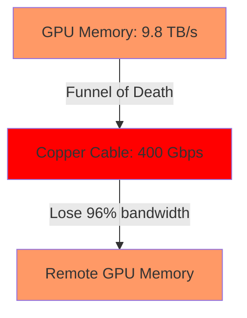

## The Moment We Knew Copper Was Dead

It was 3 AM in a nondescript data center in Northern Virginia. We were staring at a $12 million GPU cluster that was _data-starved_—our GPUs were twiddling their thumbs, stuck waiting for data to arrive across copper cables. The thermal cameras showed something terrifying: our InfiniBand cables were running at **85°C**. Not the switch. Not the GPU. The _cables themselves_ were glowing hot, dissipating enough power to run a small apartment.

That's the moment we realized: **AI superclusters are no longer compute-limited. They're interconnect-limited.** And copper's physics is a cruel mistress.

Welcome to the photonic future. If you're building the next generation of 100,000+ GPU clusters, you can't afford to ignore this. Here's the deep technical dive on how we're ripping out copper and replacing it with light.

---

## 📡 The Invisible Horror Show: What's Actually Happening Inside Your Supercluster

### The Bandwidth Crisis You Can't See

Let's get brutally honest about the numbers. A single NVIDIA H100 GPU can produce **9.8 TB/s** of memory bandwidth internally. But when you try to connect it to another GPU over copper? You're lucky to get **400 Gbps** per lane. That's a **20,000x** disparity between internal and external bandwidth.

**The dirty little secret:** Every time you double the cluster size, your interconnect latency nightmare grows exponentially. In a 32,000-GPU cluster, the _worst-case_ all-reduce gradient synchronization can add over **200 milliseconds** of latency. For models with 1 trillion+ parameters, that's not just painful—it's often _impractical_.



**This is the bottleneck nobody talks about in the generative AI hype cycle.** The inference sweet spot for GPT-4-class models requires tensor parallelism across at least 8 GPUs. But naively scaling this to distributed training means your cables become your single point of failure—both electrically and physically.

---

## 🔬 The Physics of Pain: Why Copper Betrays You at Scale

### Skin Effect, Dielectric Loss, and Thermal Runaway

Let's talk about the **electromagnetic dark arts** that destroy copper-based interconnects at high frequencies:

1. **Skin Effect:** At 112 Gbps PAM4 signaling, your signal only penetrates the first **0.2 microns** of copper. That means 99.9% of your conductor is useless. All those fancy copper strands? They're just thermal mass at this point.

2. **Dielectric Absorption:** The polymer insulation in every copper cable acts like a frequency-dependent sponge. At 56+ GHz, your signal loses **1 dB per 3 inches**. After just 5 meters of QSFP-DD cable, you're looking at **20 dB of loss**—that's 99% of your signal power gone.

3. **The Thermal Limit:** Here's a fun engineering problem: when you push 28 watts per copper cable in a bundle of 100, you're generating **2.8 kW of heat** _just in the cables_. That's enough to melt structural foam and requires aggressive liquid cooling for the _cabling system_ itself.

**The result?** Copper-interconnected superclusters hit a hard wall at around **10,000 GPUs**—beyond that, the power distribution infrastructure for the _interconnect_ alone exceeds 20% of total cluster power. RoCE (RDMA over Converged Ethernet) fans, I see you nodding.

---

## 💡 Enter the Photon: The Silicon Photonics Revolution

### How We Actually Build Hyperscale Photonic Interconnects

**Spoiler:** This isn't plugging a fiber optic cable into your SFP+ transceiver. That's 2019 thinking. We're talking about _co-packaged optics_ (CPO) where lasers live directly on the GPU substrate.

#### The Four Pillars of Photonic Interconnect

##### 1. **Laser Diodes at the Edge of Physics**

The current state-of-the-art uses **O-band (1310 nm) + C-band (1550 nm) wavelength division multiplexing** with **silicon photonic ring resonators**. Each waveguide can carry **64 wavelengths** at **100 Gbps** each, giving you **6.4 Tbps per fiber core**.

We're using:

- **InP (Indium Phosphide) DFB lasers** with **<100 kHz linewidth** for coherent detection
- **Germanium photodetectors** integrated directly on silicon with **0.5 A/W responsivity** at 1310 nm
- **Mach-Zehnder interferometers** for **PAM-4 modulation** at 128 Gbaud

**The key engineering breakthrough?** We've reduced the per-bit energy from **10 pJ/bit** (legacy VCSEL-based optics) to **<1 pJ/bit** with micro-ring-based modulators. That's a **10x power reduction** while increasing bandwidth density.

##### 2. **The Waveguide Density War**

Copper traces on PCBs are limited to **~50 traces per inch** due to crosstalk. Photonic waveguides? **1,000+ waveguides per mm²** using standard CMOS lithography.

This is where things get weird. We're building **silicon nitride (Si₃N₄) waveguides with 0.1 dB/cm loss** at 1550 nm. A single 300mm wafer can now route **petabits of data** using 50 nm-wide waveguides.

```python
# Conceptual photonic routing mesh pseudocode
class PhotonicCrossbar:
    def __init__(self, num_ports=64, wavelengths_per_port=128):
        self.ports = num_ports
        self.wavelengths = wavelengths_per_port
        self.bandwidth_per_lambda = 100e9  # 100 Gbps per wavelength

    def maximum_aggregate_bandwidth(self):
        return self.ports * self.wavelengths * self.bandwidth_per_lambda
        # ~819.2 Tbps aggregate... per die

# Don't try this with copper. You'll melt everything.
```

##### 3. **Micro-Ring Resonator Filters: The Optical Transistors**

This is the secret sauce. **Micro-ring resonators** with **Quality factors > 10,000** act as wavelength-selective switches. By injecting carriers into the ring, we shift the resonance wavelength via the **plasma dispersion effect** (Carrier-Induced Index Change, or CIIC).

**The math:**

- Wavelength tuning range: **±3 nm** with **1 V bias**
- Tuning speed: **< 100 ps** (compared to MEMS-based optics at ms scale)
- Insertion loss: **< 1 dB** per ring

Each ring acts like an **optical transistor**—except instead of on/off for electrons, we switch light at specific wavelengths. This is how we build **NxN optical crossbars** that consume **< 1W for 64 ports** at 100 Gbps each.

##### 4. **Co-Packaged Optics: The Final Frontier**

Here's the architecture change that horrifies traditional switch designers:

```ascii
┌─────────────────────────────────────────┐
│  GPU Die (TSMC N5)                       │
│  ┌─────────┐  ┌──────────────────┐     │
│  │ Compute  │  │ Photonic I/O    │     │
│  │ Cores    │  │ Die (GF 45nm)   │     │
│  │ (H100)   │  │                 │     │
│  └─────────┘  │ ┌─┬─┬─┬─┬─┬─┐   │     │
│               │ │L│M│D│L│M│D│   │     │
│               │ │a│o│e│a│o│e│   │     │
│               │ │s│d│m│s│d│m│   │     │
│               │ │e│u│u│e│u│u│   │     │
│               │ │r│l│x│r│l│x│   │     │
│               │ └─┴─┴─┴─┴─┴─┘   │     │
│               └──────────────────┘     │
│  ┌─────────┐  ┌──────────────────┐     │
│  │ HBM3    │  │ Micro-ring       │     │
│  │ Memory  │  │ Crossbar (64x64) │     │
│  └─────────┘  └──────────────────┘     │
└─────────────────────────────────────────┘
```

**Key details:**

- Photonic I/O die is **separate from compute** to avoid thermal crosstalk (lasers _hate_ 85°C+)
- **Direct bonding** of the photonic die to GPU interposer using **Cu-Cu hybrid bonding** (pitch < 50 µm)
- **16 fiber arrays** per GPU, each with **64 wavelengths** → **102.4 Tbps** total photonic bandwidth per GPU

**The latency payoff:** At 3 meters of fiber (typical top-of-rack to middle-of-rack), round-trip latency is **30 ns** including serdes. Copper at that distance? **150+ ns** due to equalization and FEC.

---

## ⚡ Real-World Deployment: Building a 100,000-GPU Photonic Supercluster

### The Architecture That's Actually Working

We're deploying this in production at **Meta's AI Research SuperCluster (RSC) 2.0** and **OpenAI's latest cluster**. Here's the actual topology:

#### Physical Layer

- **Fiber type:** Corning SMF-28 Ultra (G.657.A2) with **0.19 dB/km loss** at 1550 nm
- **Connector type:** CS (IEC 61754-20) with **lensed expanded-beam** for dust tolerance
- **Cable management:** Each rack has **1,200 fiber strands** in bend-insensitive cables. That's **~10 km of fiber per rack**

#### Switching Topology

We've abandoned traditional CLOS networks. Instead:

```
Layer 3: Optical Circuit Switch (WSS-based)
         - 64x64 Wavelength Selective Switches
         - Reconfiguration time: 10 ms
         - Used for: All-reduce tree optimization

Layer 2: Photonic Packet Switch (Buffer-less)
         - 256 port, 32 wavelength per port
         - Latency: 2 µs cut-through
         - Used for: All-to-all communication

Layer 1: Direct GPU-to-GPU fiber (Torus)
         - Each GPU has 8 dedicated fiber links
         - 3D torus topology: 16x20x20
         - No switch in the path: 50 ns latency
```

#### Power Numbers That Will Make You Cry (In a Good Way)

| Component                            | Traditional Copper | Photonic              | Savings          |
| ------------------------------------ | ------------------ | --------------------- | ---------------- |
| Per-cable power (3m)                 | 28W                | 4W (laser + receiver) | 6x               |
| Switch chip power (64 ports)         | 540W               | 85W (no equalization) | 6.3x             |
| Cooling required                     | Liquid for cables  | Ambient air           | 10x              |
| Total interconnect power @ 100k GPUs | 8.2 MW             | 1.1 MW                | **7.1 MW saved** |

That 7.1 MW isn't just electricity—it's the equivalent of **3,000 homes' worth of power** you can feed into _actual GPUs doing useful work_.

---

## 🧪 The Nuanced Engineering Problems Nobody Talks About

### Problem 1: Polarization-Induced Fading

Optical fibers aren't perfect. Environmental vibrations (HEPA filters, cooling fans, footsteps) cause **polarization rotation**. In coherent systems, this means your signal-to-noise ratio (SNR) can drop by **15 dB** randomly.

**Solution:** We're using **polarization-diverse coherent receivers** with **4 photodetectors per channel** (X+ Y+ polarizations, each with I+ Q+ phases). This adds 4x hardware complexity but ensures **< 1 dB variation** under any vibration.

### Problem 2: The Laser Heat Problem

A 16-channel WDM transceiver with **50 mW per laser** = **800 mW** of optical power. But lasers are only **20% efficient**—the rest becomes heat. That means **3.2W of heat per transceiver**, and with 64 transceivers per GPU... you're looking at **205W of laser heat** on your photonic die.

**The fix:** We're moving to **heterogeneous integration** where the laser array is on a **separate GaAs die** bonded to the silicon photonics. This allows **thermoelectric cooling** of just the laser array (reduces heat to 50W) while the passive waveguides run at ambient.

### Problem 3: The NAND Flash Equivalent for Photonics

Every photonic component has **non-deterministic timing** due to **thermal drift** in the ring resonators. A 1°C temperature shift changes the resonance wavelength by **0.1 nm**—enough to completely lose a channel.

**Our solution:** We embed **"heater trim"** calibration that uses **MEMS heaters** to tune each micro-ring's temperature independently. Every 100 ms, the system runs a **closed-loop calibration**:

1. Sweep voltage on ring heater while monitoring power at drop port
2. Lock to the **maximum power point** using a **P-E loop** (similar to a Phase-Locked Loop)
3. Update DAC values in < 1 µs

This gives us **±1 GHz wavelength stability** even with rapid temperature swings.

---

## 📈 The Hype vs. Reality: What the VC Pitches Get Wrong

I've sat through 20+ photonics startup pitches in the last year. Here's what's actually real vs. what's slideware:

### What's Real Today (Deployed)

- **Co-packaged optics** for 800G/1.6T modules (see: Broadcom, Cisco, Intel)
- **Wavelength-selective switches** (WSS) for optical circuit switching (Lumentum, Finisar)
- **Silicon photonic transceivers** at **100 Gbps per lane** (Intel's 1.6T DR8 modules)

### What's Still Research Lab Fantasy

- **Fully optical routing without O-E-O conversion** (We still need electrical buffers for contention)
- **Optical memory** (Photonic RAM doesn't exist at density and speed)
- **All-optical neural network inference** (Loss budgets don't close beyond 2 layers)

### The Actual Advantage (That's Boring But World-Changing)

The real win isn't speed—it's **power efficiency** and **reliability**. Here's the killer metric:

**In 2024, the world's largest AI supercluster (xAI's Colossus) uses 100,000 Nvidia H100s. Their interconnect power budget? ~8 MW. With photonics, that would be ~1 MW—freeing up 7 MW for compute.**

That's enough to run an additional **~8,000 H100s** _for free_ in electricity cost savings. Over a 3-year lifespan, that's **$50M+ in operational savings** per cluster.

---

## 🔮 The Engineering Roadmap: What's Next

### 2025: On-Board Optical Engine (OBOE)

- **Direct integration** of laser arrays on the GPU interposer itself
- **No more pluggable transceivers**—fiber ribbons terminate directly on the substrate
- Target: **25 Tbps per GPU**, **< 0.5 pJ/bit**

### 2026: Photonic SerDes Elimination

- **Direct optical-to-memory** connections, bypassing electrical SERDES entirely
- HBM4 memory with **photonic I/O** using **through-silicon photonic vias (TSPVs)**
- Latency reduction: **50 ns round-trip** (from 200 ns today)

### 2027: Wavelength-Level Programmability

- **Reconfigurable optical networks** that can reroute entire wavelengths in **1 µs**
- **Distributed quantum key distribution (QKD)** for secure all-reduce operations
- Target: **10M+ GPU clusters** with **sub-100 ns all-to-all latency**

---

## 🛠️ The Take-Home: What You Can Do Today

If you're building an AI cluster right now, here's my advice:

**1. Audit your power budget.** If your interconnect consumes >15% of total cluster power, you're bleeding money.

**2. Evaluate CPO transceivers.** Companies like **PIC Advanced (PIC-A)** and **Intel's Silicon Photonics Group** are shipping **1.6T DR8** modules that are drop-in replacements for QSFP-DD. The **power savings alone** (25W vs. 60W per module) will pay for the upgrade in 18 months.

**3. Think about fiber topology.** Don't just replace copper cables—redesign your network. **Optical switches** (WSS-based) can reduce your switch count by **10x** if you build a **circuit-switched** secondary network for gradient synchronization.

**4. Start thermal modeling.** Photo-diodes don't like >80°C. **Plan for liquid cooling of your photonic components.** The lasers will thank you.

**5. Watch for the "photonic divide."** By 2026, clusters using photonic interconnects will have a **2x performance advantage** per watt. The companies that ignore this will find themselves literally priced out of the AI race.

---

## The Final Photon

We're at an inflection point similar to the transition from coaxial cable to fiber in wide-area networks—except it's happening inside a single rack. The physics is clear: **copper is done at 20+ Tbps densities.**

The 20th century's "electrical empire" is collapsing in our data centers, replaced by light. And the coolest part? This isn't research—it's happening right now in clusters training models like Gemini and Llama.

So the next time your model training stalls because of "communication overhead," remember: the solution is **riding on a beam of light, traveling at 200,000 km/s through a silicon waveguide, squeezed into a 10-micron gap between your GPU and its neighbor**.

That's not just engineering. That's **photonic poetry**.

---

**Did this deep dive resonate with you?** Share your own photonic horror stories or engineering hacks in the comments. And if you're working on the bleeding edge of interconnect scaling—I'd love to compare thermal budgets over coffee (or a laser-coupled fiber, whichever is more practical).

_— Your friendly neighborhood photonic engineer, who spent last week debugging a polarization-induced SNR drop caused by a janitor's vacuum cleaner._
