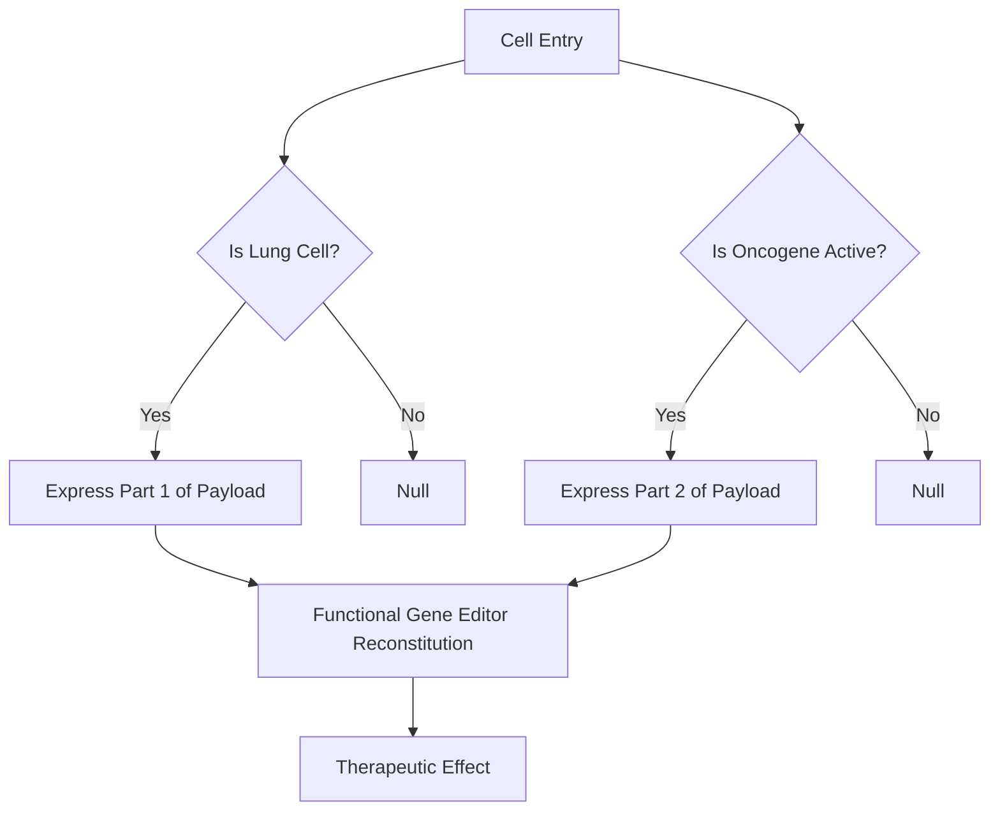

Imagine you’ve spent a decade perfecting the world’s most sophisticated code editor. It’s elegant, it’s powerful, and it can fix any bug in a legacy codebase with surgical precision. But there’s a catch: the only way to deploy your editor to a client’s server is to put it in a bottle, throw it into the ocean, and hope it washes up at the right data center. Even if it does, it might accidentally overwrite the operating system instead of the target application.

In the world of genomic medicine, we have the editor. CRISPR-Cas9, base editors, and prime editors are the "IDE" of the future. But the "deployment" mechanism—the delivery system—is still operating on 1990s infrastructure.

For years, we’ve relied on Adeno-Associated Viruses (AAVs) to carry our genetic payloads. They are the workhorses of the industry, but they are "dumb" vectors. They go where they want (mostly the liver), they turn on when they feel like it, and they stay on forever. If we want to move from "bespoke biological experiments" to "scalable therapeutic infrastructure," we have to refactor the viral vector from the ground up.

We aren't just delivering genes anymore. We are building **spatiotemporally controlled, tissue-specific, bio-computational systems.**

---

## The Legacy Debt of Viral Infrastructure

To understand where we’re going, we have to look at the "legacy code" of AAVs. Naturally occurring AAV serotypes (like AAV2 or AAV9) evolved to infect humans, not to serve as precision delivery vehicles. Using a wild-type AAV for gene therapy is like using a generic delivery truck to deliver a high-security server: it’s recognizable, it fits on the road, but it lacks the telemetry, specialized cooling, and security protocols required for a high-stakes deployment.

The current bottlenecks in viral vector engineering are three-fold:

1.  **Tropism (The Routing Problem):** AAVs have a high affinity for the liver. If you’re trying to treat a muscle disorder or a neurological condition, 90% of your "bandwidth" (the viral dose) is wasted on the liver, leading to toxicity and "signal noise."
2.  **Immunogenicity (The Firewall Problem):** Most humans have been exposed to wild-type AAVs. Our immune systems treat them like a DDoS attack, neutralizing the vector before it can deliver its payload.
3.  **Constitutive Expression (The "Always-On" Bug):** Once a vector enters a cell, it typically starts expressing its cargo immediately and never stops. In many therapies, we need a "Cron job"—an expression that only triggers under specific conditions or for a specific duration.

---

## Refactoring the Hardware: ML-Driven Capsid Engineering

The "hardware" of the virus is its capsid—the protein shell that protects the genetic material and determines where the virus goes. In the old days, we used **Directed Evolution**: basically, we’d create a library of random mutations, throw them at a problem, and see what stuck. It was a brute-force search algorithm with a very low success rate.

Today, we are shifting toward **In Silico Design and Machine Learning (ML).**

### The Protein Transformer

We are now treating protein sequences like natural language. By training Transformer-based models on millions of known AAV variants, we can map the "latent space" of capsid fitness. These models allow us to predict which amino acid substitutions will allow a virus to bypass the Blood-Brain Barrier (BBB) or avoid neutralizing antibodies.

```python
# Conceptual pseudocode for a Capsid Fitness Predictor
import torch
from bio_transformer import CapsidModel

model = CapsidModel.load_pretrained("AAV-Architecture-v4")

# Define a candidate sequence for the VP1 protein
candidate_sequence = "MAADGYLPDWLEDNLSEGIREWW..."

# Predict "Tropism Score" for CNS vs. Liver
scores = model.predict_tropism(candidate_sequence)

if scores['CNS'] > 0.85 and scores['Liver'] < 0.10:
    print("Promising candidate for neuro-specific delivery.")
    deploy_to_wet_lab(candidate_sequence)
```

By leveraging **Variational Autoencoders (VAEs)**, we can generate "hallucinated" capsids that have never existed in nature. These synthetic capsids are "stealth" vectors—they are functionally viral but antigenically invisible to the human immune system. This is the equivalent of rotating your IP addresses to bypass a global blacklist.

---

## The Software Layer: Synthetic Promoters and Logic Gates

The capsid gets you to the right "data center" (the tissue), but how do you ensure the code only runs on the right "server" (the specific cell type)? This is where **Synthetic Promoter Engineering** comes in.

Standard promoters (like CMV or EF1α) are "root-level" access—they turn on in almost any cell. In next-gen engineering, we are building **Conditional Logic Gates** directly into the DNA.

### The AND Gate Architecture

Imagine a therapy for a specific type of lung cancer. We only want the gene editor to activate if the cell is:

1.  A lung cell (Spatial control).
2.  Actively dividing (State control).
3.  Expressing an oncogenic marker (Disease control).

We can achieve this using a **Boolean AND gate**. We split the gene editor into two inactive halves (split-Cas9). Half A is driven by Promoter 1, and Half B is driven by Promoter 2. The functional editor only assembles if both promoters are active simultaneously.



### MicroRNA (miRNA) Target Sites: The "NOT" Gate

We can also use the cell's own regulatory machinery as a "NOT" gate. By embedding miRNA target sequences in the 3' UTR of our viral payload, we can "blacklist" certain tissues. If the virus enters a liver cell, and that cell contains `miRNA-122`, the `miRNA-122` will bind to our payload's mRNA and trigger its degradation.

**Logic:** `Execute Payload IF (Tissue == Target) AND NOT (Tissue == Liver)`.

---

## Spatiotemporal Control: The "API Call" for Genes

The ultimate goal of gene editing is not just "on," but "when" and "how much." We need an interface to interact with the therapy after it has been deployed. This is **Temporal Control.**

### Optogenetics: Light-Triggered Deployment

In neurological applications, we can engineer viral vectors that respond to specific wavelengths of light. By using light-sensitive proteins like **Channelrhodopsins** or **Cryptochromes**, we can trigger the expression of a gene simply by shining a micro-LED on the target area. This provides millisecond-level precision—low latency for biological systems.

### Small Molecule Switches: The "Dox" Trigger

The most common "API" for gene therapy is the **Tetracycline-On (Tet-On)** system. The gene editor is only expressed if the patient takes a specific, harmless small molecule (like Doxycycline).

- **The Advantage:** If a patient experiences a side effect, you simply stop the medication, and the "process" is killed.
- **The Engineering Challenge:** These systems are often "leaky." Even without the drug, there is some baseline expression (background noise). Next-gen engineering involves refactoring these switches using **Degrons**—protein tags that mark the payload for immediate destruction unless the small molecule "shield" is present.

---

## Compute at Scale: The High-Throughput Bio-Pipeline

Designing these systems requires an immense amount of data. We are no longer testing one or two designs; we are testing millions. This requires a **Biological CI/CD Pipeline.**

1.  **Library Synthesis:** Using high-fidelity DNA synthesis to create 10^5 unique viral variants.
2.  **Pooled Screening:** Injecting the entire library into a model organism (e.g., a non-human primate).
3.  **Single-Cell Sequencing (The Debugger):** We harvest the tissues and use single-cell RNA sequencing (scRNA-seq) to see exactly which viral variant ended up in which cell and how much payload it expressed.
4.  **Feedback Loop:** The data from the scRNA-seq is fed back into the ML models to refine the next generation of capsids.

This is the biological version of **A/B testing at the edge.** We aren't guessing what works; we are observing the fitness of a million different "deployments" in parallel.

---

## Why the Hype is Real (and Why it’s Different This Time)

If you follow biotech news, you’ve heard the hype around "In Vivo Gene Editing." The reason this is gaining massive traction now—and why firms like NVIDIA are suddenly heavily invested in "Bio-Compute"—is that we are finally solving the **Manufacturing and Scalability problem.**

Earlier gene therapies (like CAR-T) were "Ex Vivo." You took cells out of the patient, edited them in a lab (the "staging environment"), and put them back in. This is incredibly expensive, slow, and hard to scale. It’s the equivalent of having to manually configure every single server in your fleet.

**In Vivo** therapy—editing the genes directly inside the body—is the "Serverless" version of medicine. You inject the vector, and it handles the deployment, scaling, and execution automatically. But this only works if the vector is smart enough to handle its own routing and security.

The recent breakthroughs in **Lipid Nanoparticles (LNPs)**—the tech that powered the COVID-19 mRNA vaccines—have also lit a fire under viral vector engineering. LNPs are great for the liver, but AAVs are still the gold standard for the brain, heart, and muscles. The "Capsid vs. LNP" race is the "AWS vs. Azure" of the biotech world, and it's driving innovation at an unprecedented pace.

---

## The Engineering Curiosities: "Ghost" Capsids and Cargo Compression

### 1. The 4.7kb Constraint

The AAV genome is tiny—about 4.7 kilobases. That’s like trying to run a modern GUI on a Commodore 64. A standard Cas9 protein plus its guide RNA and a promoter barely fits. To solve this, engineers are:

- **Minifying the Code:** Discovering "Mini-Cas" proteins (like Cas12j or CasX) that are half the size.
- **Distributed Systems:** Using two different AAVs to carry two halves of a large payload, which then "re-link" inside the cell using **Protein Trans-Splicing**.

### 2. Post-Translational Logic

We’re moving beyond DNA-level logic to protein-level logic. By using **Proteolysis-Targeting Chimeras (PROTACs)**, we can design payloads that are only stable if a specific disease-associated protein is present. This is essentially a "Garbage Collection" (GC) mechanism that we’ve hijacked to serve as a diagnostic filter.

---

## The Road Ahead: From One-Offs to a Bio-Operating System

We are transitioning from a world where we "treat diseases" to a world where we "patch biological bugs."

The next generation of viral vector engineering isn't just about better delivery; it's about **programmability.** We are building a stack where:

- **The Capsid** is the Network Layer (Routing/IP).
- **The Synthetic Promoter** is the Identity and Access Management (IAM).
- **The miRNA Targets** are the Firewall/Security Rules.
- **The Small-Molecule Switch** is the API/User Interface.
- **The Gene Editor** is the Binary Executable.

When we can reliably deliver a specific payload to a specific subset of neurons and trigger it only when a patient enters a specific physiological state, we will have moved past "medicine" as we know it. We will be "sysadmins" for the human body.

The infrastructure is being built right now. The code is being written in A, C, G, and T. And the deployment? It's going to be a viral sensation.
