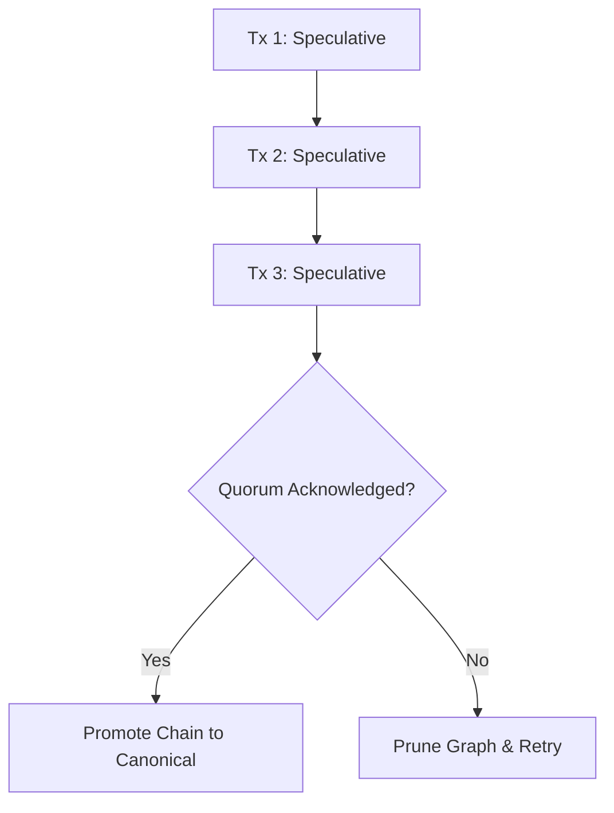

The year is 2024, and the speed of light is officially too slow.

If you’re building a global-scale fintech platform, a real-time multiplayer engine, or a high-frequency trading system, you’ve hit the wall. You’ve optimized your Rust binaries, you’ve fine-tuned your eBPF probes, and you’ve moved your workloads to the edge. But when your user in Tokyo wants to update a record that is mastered in a data center in Northern Virginia, you are at the mercy of physics.

In a distributed database, consistency isn't free. The "Gold Standard" of consistency—**Linearizability**—usually requires a majority of nodes to agree on the order of operations. This means waiting. And in a multi-region setup, that wait is the difference between a "snappy" 50ms interaction and a "janky" 400ms lag spike.

We call this the **Tail Latency Problem**. While your median (P50) latency looks great, your P99 and P99.9 values are likely a horror show of network jitters, packet loss, and cross-continental round-trips.

Today, we’re diving deep into the next frontier of distributed systems: **Predictive Consensus Protocols**. This isn't just about making things faster; it’s about using machine learning and speculative execution to "guess" the future of the network, effectively hiding the speed of light from your users.

---

## The Tyranny of the Quorum

To understand the solution, we have to respect the problem. Most modern distributed databases (CockroachDB, TiDB, YugabyteDB) rely on **Raft** or **Paxos** for consensus. These protocols are brilliant, but they are fundamentally "chunky" across long distances.

In a standard Raft implementation, a write follows this path:

1.  **Client** sends a request to the **Leader**.
2.  **Leader** appends the entry to its local log.
3.  **Leader** sends `AppendEntries` RPCs to all **Followers**.
4.  **Leader** waits for a **Majority Quorum** (N/2 + 1) to acknowledge.
5.  **Leader** commits the entry and tells the **Client** "Success!"

If your nodes are in `us-east-1`, `us-west-2`, and `eu-central-1`, a write in Virginia has to wait for a round-trip to Oregon just to satisfy the quorum. If the network between Virginia and Oregon hiccups—congratulations, your P99 just spiked to 600ms.

### Why "Average" Latency is a Lie

In microservices, the **Amplification of Tail Latency** is a silent killer. If your page load requires 10 serial database calls, and each call has a 1% chance of hitting a 500ms tail, your probability of a slow page load isn't 1%—it’s roughly 10%. At scale, your "worst-case" scenario becomes your "every-user" scenario.

---

## The Hype vs. The Substance: What is Predictive Consensus?

In the last 18 months, there’s been significant chatter around "AI-driven databases." Most of it is marketing fluff—SQL autocomplete or natural language queries. But underneath the hype, a very real technical revolution is happening in the **Consensus Layer**.

**Predictive Consensus** is the application of statistical modeling and speculative execution to the Paxos/Raft log. Instead of waiting for the network to confirm a majority, the system predicts the outcome of the vote based on historical node behavior and network topology.

It’s essentially **Branch Prediction for Distributed Systems**.

### The Core Idea

If a Leader node knows that Node A and Node B have responded within 30ms for the last 10,000 requests with 99.999% reliability, it can **speculatively commit** an operation and return a response to the client _before_ the physical packets from Node A and B actually arrive.

If the prediction is right, you've saved 30-50ms of RTT. If it's wrong (a "mis-speculation"), you trigger a rollback or a compensation transaction.

---

## Deep Dive: The Architecture of a Predictive Consensus Engine

Building this isn't as simple as adding a `predict()` function. It requires a fundamental re-architecting of the database's replication state machine. Let's look at how we'd build a system we'll call **Lumina-KV**.

### 1. The Network Oracle (The "Predictor")

The heart of the system is the Network Oracle. It sits alongside the Consensus Module and ingests high-resolution telemetry from the network stack.

- **Input Features:** TCP RTT, packet loss rates, jitter, internal queue depths of follower nodes, and even BGP route flap alerts.
- **Model:** A lightweight, online-learning **Kalman Filter** or a **Gated Recurrent Unit (GRU)**. It doesn’t need to be ChatGPT; it needs to be fast (sub-microsecond inference).
- **Confidence Scoring:** The Oracle doesn't just say "Yes" or "No." It provides a confidence score. If `Confidence > 0.999`, the system proceeds with a speculative commit.

### 2. Speculative State Buffers

You cannot mutate the "canonical" state of the database with a guess. That would violate ACID. Instead, Lumina-KV uses **Speculative State Buffers**.

When a write is predicted to succeed:

1.  The write is applied to a **Speculative View** of the data.
2.  The response is returned to the client with a `Speculative-Header`.
3.  The client's session enters a "Optimistic Mode."

### 3. The Speculative Commit Loop (Rust pseudocode)

```rust
async fn handle_write_request(&self, req: WriteRequest) -> Response {
    let log_index = self.raft.append_local(req).await;

    // Consult the Network Oracle
    let (prediction, confidence) = self.oracle.predict_quorum_at(log_index);

    if confidence > self.config.speculative_threshold {
        // Return to client immediately!
        tokio::spawn(self.finalize_consensus(log_index));
        return Response::speculative_ok(req.id);
    }

    // Fallback to standard Raft behavior
    self.raft.wait_for_quorum(log_index).await;
    Response::canonical_ok(req.id)
}
```

### 4. Conflict Resolution and "The Ghost of Consistency"

What happens if the prediction is wrong? Suppose Node A and Node B both go down simultaneously (a "correlated failure"). The majority quorum is never reached.

This is where the engineering gets hairy. The system must perform a **Speculative Rollback**.

- **Client-Side Impact:** The client must be able to handle a "Revocation" message or the database must ensure that any subsequent reads from that client are consistent with the _rolled-back_ state.
- **External Effects:** If the database write triggered an email or a bank transfer, you're in trouble. This is why Predictive Consensus is typically reserved for **internal state transitions** or systems with **Sagas/Compensating Transactions**.

---

## Tackling the "Speed of Light" at the Infrastructure Level

Predictive consensus is a software solution, but it’s fueled by infrastructure telemetry. To make these predictions accurate, we have to look at the compute scale.

### The Compute Scale of Prediction

When we talk about P99s, we're talking about micro-outages. To predict these, your database nodes need to be looking at the network at the **nanosecond level**.

At a certain scale, standard Linux networking isn't enough. Many teams are moving toward **User-space TCP stacks** and **DPDK (Data Plane Development Kit)** to bypass the kernel entirely. By doing this, the Network Oracle has direct access to the NIC queues.

If the Oracle sees the hardware transmission queue for the "Virginia-to-Oregon" fiber link filling up, it can instantly drop the confidence score for speculative writes, shifting the system back to "Conservative Mode" before the first packet is even dropped.

### Cross-Region Topology Awareness

Modern predictive systems also use **Topology-Aware Quorums**.
In a 5-node cluster spread across:

- `us-east-1a`
- `us-east-1b`
- `us-east-1c`
- `us-west-2`
- `eu-west-1`

The system knows that `us-east` nodes are physically closer. It will weight its predictions toward the local AZs, but it will also maintain a "shadow" prediction for the cross-region nodes to guard against a total AWS Region outage.

---

## Why Is Everyone Talking About This Now?

The surge in interest isn't accidental. It’s driven by three major shifts in the industry:

1.  **The Rise of Edge Computing:** As we move logic to Cloudflare Workers or Vercel Functions, the distance between the "Compute" and the "Source of Truth" (the DB) is increasing. We need the DB to feel local, even when it isn't.
2.  **Serverless Database Expectations:** Users of PlanetScale or Neon expect "instant" scaling and performance. They don't want to think about regions. Predictive consensus allows these providers to offer a "Global Endpoint" that doesn't suck.
3.  **Hardware Acceleration:** With the advent of SmartNICs and DPDK, the computational overhead of running a machine learning model on every network packet has dropped from "impossible" to "negligible."

---

## The Engineering Curiosity: "Wait-Free" Linearizability?

One of the most fascinating aspects of this research is the move toward **Wait-Free Consensus**. In a typical system, progress is blocked if nodes are slow. In a predictive system, we are experimenting with the idea of **Continuous Progress**.

If the system is confident enough, it can continue to process a chain of dependent transactions (`TxB` depends on `TxA`) even if `TxA` hasn't technically reached a quorum yet. This creates a **Dependency Graph of Speculations**.



The complexity here is astronomical. If `Tx 1` fails, you have to prune the entire tree. But the performance gains? We’re talking about a **5x to 10x reduction in P99 latency** for multi-region clusters.

---

## Is This Safe for Production?

The million-dollar question. Can you trust a "prediction" with your financial ledger?

The answer lies in the **Validation Path**. In a predictive consensus model, the "Slow Path" (the actual Raft/Paxos quorum) still runs in the background. It is the final arbiter of truth.

Think of it like this:

- **The Predictive Path** is for the **User Experience** (UI updates, low-value transactions).
- **The Canonical Path** is for the **Durability Guarantee**.

If the Canonical Path ever disagrees with the Predictive Path, the system enters a recovery state. For 99.9% of operations, they will agree. The "Tail" is that 0.1% where the network flaked, and that’s where the system earns its keep by either masking the delay or handling the error gracefully.

### Real-World Precedents

- **Calvin (used in FaunaDB):** Uses a deterministic sequencing layer to reduce the need for traditional locks, which is a cousin to predictive ordering.
- **SLOG:** A storage layer that moves "mastership" of data dynamically to where the traffic is, predicting which region will need the data next.

---

## The Road Ahead: Generative Consensus?

As we look toward the future, we might see the emergence of **Generative Consensus**. Imagine a system where the "Predictor" isn't just looking at network stats, but is actually a transformer model trained on the entire history of the database’s state transitions.

It could predict not just _if_ a write will succeed, but _what_ the next likely writes will be, pre-fetching data and pre-ordering the log before the client even clicks "Submit."

We are moving away from databases as passive bit-buckets and toward databases as **intelligent, proactive agents** that understand the physics of the global internet.

## The Final Word (For Now)

Solving the tail latency problem in multi-region databases isn't just about writing better code; it's about changing our relationship with time and consistency. For decades, we've accepted the "Speed of Light" as a hard cap on distributed system performance.

Predictive Consensus proves that while we can't break the laws of physics, we can certainly outsmart them. By layering statistical confidence over rigid consensus protocols, we're finally building systems that are as global as the users they serve—without the 500ms tax.

The next time you see a P99 spike in your dashboard, don't just reach for the load balancer config. Ask yourself: **"Why are we waiting for the network to tell us something we already know is going to happen?"**

That’s where the future of the cloud lives.

---

**Engineering Notes & Further Reading:**

- _Keep an eye on papers coming out of the University of Washington and MIT regarding "Speculative Paxos."_
- _Look into "Clock-SI" for time-based snapshot isolation in geo-distributed systems._
- _Check out the Raft TLA+ specifications to understand how to formally verify speculative extensions._

**Are you implementing predictive layers in your stack? We want to hear about it. Drop a comment or reach out on our engineering Slack.**
