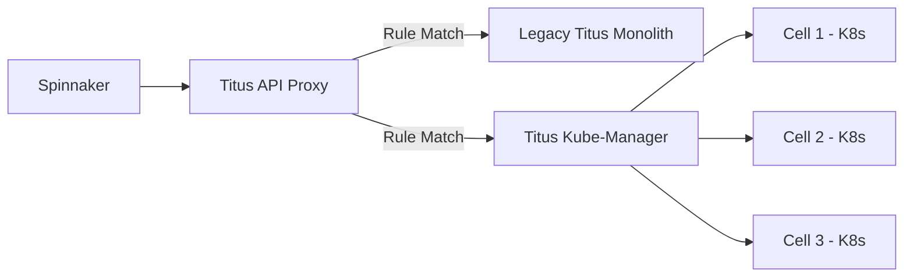

It’s 8:00 PM on a Friday night. A new season of a global hit series has just dropped. Millions of users across six continents simultaneously hit the "Play" button. Behind that simple interaction lies a monstrously complex orchestration of thousands of microservices, distributed across tens of thousands of EC2 instances, managing millions of containers.

For years, the heart of this operation was **Titus**—Netflix’s homegrown container management platform. Titus was a marvel of engineering, a bespoke orchestrator built when Kubernetes was still in its infancy. But as Netflix’s global footprint expanded and the complexity of our workloads evolved, even a titan like Titus hit the ceiling of monolithic scaling.

The challenge wasn't just "running containers." It was about maintaining a **globally consistent, low-latency, and highly resilient control plane** capable of surviving regional outages while managing the sheer throughput of the world's largest streaming service.

To solve this, we embarked on one of the most ambitious infrastructure migrations in our history: **moving from a monolithic Titus control plane to a geographically distributed, federated Kubernetes mesh.** This isn't just a story about adopting K8s; it’s a blueprint for how to rebuild the engines of a jet while flying at Mach 2.

---

## The Genesis: Why Titus Had to Evolve

In the early 2010s, the container orchestration landscape was a Wild West. Docker was new, and Kubernetes didn't exist. Netflix built Titus on top of Apache Mesos to provide deep integration with Amazon VPC, security groups, and our internal telemetry systems.

Titus was revolutionary because it treated containers as first-class citizens in the AWS ecosystem. However, it was built as a **centralized monolith per region**.

### The Monolithic Bottleneck

As our scale grew to millions of container launches per day, we began to see the "Blast Radius" problem.

1.  **The etcd / Persistence Strain:** A single large state store for a whole region meant that a slow disk or a surge in write volume could lock up the entire control plane.
2.  **The "Thundering Herd":** When a regional failover occurred, the Titus control plane would be slammed with thousands of requests per second, leading to cascading failures in the scheduler.
3.  **The Maintenance Burden:** Every new feature required custom coding within the Titus core. We were missing out on the massive innovation happening in the CNCF (Cloud Native Computing Foundation) ecosystem.

The hype around Kubernetes wasn't just about the API; it was about the **extensibility**. We realized that by migrating to a federated Kubernetes model, we could offload the "boring" parts of orchestration (scheduling, lifecycle management) to the community and focus our engineering talent on Netflix-specific logic.

---

## The Architecture: A Federated Mesh of Clusters

We didn't just want one giant Kubernetes cluster per region. That would just be "Monolithic Titus 2.0." Instead, we moved toward a **Federated Mesh** architecture.

In this model, a "Region" is no longer a single control plane. It is a collection of **Cells**—independent Kubernetes clusters that are abstracted away from the developer by a **Global Control Plane (GCP)**.

### The "Cell" Concept

Each cell is a fully functional, self-contained Kubernetes cluster. This provides:

- **Reduced Blast Radius:** If a cluster’s `etcd` becomes corrupted or a controller goes rogue, it only affects a fraction of the workloads.
- **Version Heterogeneity:** We can canary new Kubernetes versions one cell at a time.
- **Scale Limits:** Kubernetes starts to struggle at 5,000+ nodes. By using cells, we stay well within the "sweet spot" of K8s performance.

### The Federation Layer: Titus-Kube-Manager

To keep the developer experience seamless, we built the **Titus-Kube-Manager**. This is the brain that sits above the individual clusters. When a service (like the Netflix API) requests a deployment, the Kube-Manager decides which cell has the capacity and the right "affinity" for that workload.

```yaml
# A simplified look at how a Titus Workload is abstracted
apiVersion: titus.netflix.com/v1
kind: TitusWorkload
metadata:
    name: edge-proxy-api
spec:
    capacityGroup: "edge-tier"
    geoStrategy:
        distribution: "GlobalParallel"
        regions: ["us-east-1", "eu-west-1", "ap-northeast-1"]
    resourceConfig:
        cpu: 16
        gpu: 0
        mem: 64Gi
        network: 10Gbps
```

---

## Technical Deep Dive: Networking and the VPC-CNI Challenge

One of the "Magic" features of Titus was its high-performance networking. We didn't want the overhead of an overlay network (like Flannel or Calico). We needed **direct VPC routing**.

When moving to the Federated Mesh, we had to solve for **IP Address exhaustion**. At Netflix scale, assigning a unique VPC IP to every single container in a giant subnet is a recipe for disaster.

### The Solution: Branch ENIs and Trunking

We leveraged **AWS Trunking**. Instead of every pod taking up a slot on a primary Elastic Network Interface (ENI), we use "Branch ENIs." This allows us to pack hundreds of pods onto a single EC2 instance, each with its own security group and its own VPC IP, without hitting the hardware limits of the Nitro system.

This integration was built into our custom **Titus CNI**. When a pod is scheduled to a cell:

1.  The **Titus-Kube-Manager** requests a branch ENI from the AWS control plane.
2.  The **Kubelet** on the target node waits for the ENI to be "plumbed."
3.  The **Titus CNI** configures the network namespace with the correct routing rules.

This gives us the performance of bare-metal networking with the flexibility of Kubernetes pods.

---

## The Persistence Problem: Solving etcd Bottlenecks

In a standard Kubernetes setup, `etcd` is the source of truth. At Netflix, our `etcd` clusters are subjected to extreme pressure. Imagine 50,000 pods all reporting status changes simultaneously during a deployment.

To handle this in the Federated Mesh, we implemented several optimizations:

1.  **Eventual Consistency for Observability:** We offloaded pod status reporting from the main `etcd` to a secondary, high-throughput stream (using Mantis, our stream processing engine). The control plane doesn't need to know _every_ micro-update about a pod's memory usage to make a scheduling decision.
2.  **Sharding by Workload Type:** We separate "Batch" clusters (short-lived, high-churn jobs) from "Service" clusters (long-lived, stable microservices). This prevents a massive batch job from starving the API of resources.
3.  **Optimized Compaction:** Standard Kubernetes compaction intervals were too slow for us. We developed custom controllers that monitor `etcd` revision bloat and trigger aggressive compaction and defragmentation during low-traffic windows.

---

## Changing the Engines: The Migration Strategy

How do you migrate thousands of microservices from a legacy monolith to a new Federated Mesh without a single second of downtime? We used a strategy we call **"The Shadow Plane."**

### Step 1: The Proxy Layer

We inserted a gRPC proxy between our deployment tools (Spinnaker) and the Titus API. This proxy could route requests to either the legacy Titus stack or the new Kubernetes-backed stack based on a set of dynamic rules.

### Step 2: Shadow Traffic

For months, we sent "Shadow Traffic" to the Kubernetes mesh. We would take a real production request, clone it, and send the clone to the K8s control plane. We compared the results: Did the K8s scheduler pick the same node? Was the latency comparable? We didn't actually launch the containers; we just validated the logic.

### Step 3: The "Cellular" Rollout

Once confident, we started moving services by **Capacity Group**.

- **Tier 3 (Internal tools):** Moved first. If the control plane lagged, only engineers were grumpy.
- **Tier 2 (Background processing):** Moved second.
- **Tier 1 (The "Play" Button):** Moved last, one region at a time.



---

## Infrastructure as a Service: The Developer Experience

A major goal was to ensure that developers didn't have to become Kubernetes experts. If you ask a UI engineer to write a 400-line YAML file with 15 sidecars just to deploy a Node.js app, you've failed.

We built a **Layer of Abstraction** over the Federated Mesh.

- **Sidecar Injection:** We use Mutating Admission Controllers to automatically inject Netflix-standard sidecars for logging (Logback), telemetry (Atlas), and service discovery (Eureka).
- **Sensible Defaults:** Most services at Netflix follow a standard pattern. Our "TitusWorkload" CRD assumes these patterns, reducing the required configuration from hundreds of lines to just ten.
- **Automated Remediation:** If a cell starts underperforming, the Titus-Kube-Manager automatically "evicts" workloads to a healthy cell. The developer doesn't even get paged.

---

## The Engineering Curiosity: The "Zombie Pod" Problem

During the migration, we encountered a fascinating technical glitch: **The Zombie Pods.**

Because we were running a federated mesh, there were rare cases where the Global Control Plane thought a pod was deleted, but the local K8s Cell still had it running (usually due to a network partition between the two). These "Zombies" continued to consume resources and, worse, continued to serve traffic.

We solved this by implementing a **Bi-Directional Reconciliation Loop**.
Every 30 seconds, each local cell sends a "Heartbeat Manifest" (a compressed Bloom filter of all active Pod IDs) to the Global Control Plane. If the Global Control Plane sees a Pod ID in the filter that it has no record of, it issues a "Hard Kill" command to the cell. This keeps the global state eventually consistent without the overhead of constant full-state synchronization.

---

## Why This Matters: The Results

The migration to a Federated Kubernetes Mesh has fundamentally changed how Netflix operates:

- **Scaling Velocity:** We can now spin up an entire new Kubernetes cell in a new AWS region in under 20 minutes.
- **Reliability:** We have seen a **70% reduction in global control plane incidents**. By isolating failures to individual cells, we’ve effectively eliminated the risk of a global "darkness" event caused by the orchestrator.
- **Community Leverage:** We are now contributing back to Kubernetes. Our work on high-throughput scheduling and VPC-CNI optimizations is helping the broader community scale their own clusters.

### Key Metrics:

- **Max Throughput:** 500,000+ container operations per minute during peak scale-up.
- **Control Plane Latency:** P99 of <200ms for pod scheduling globally.
- **Footprint:** Managing 200+ Kubernetes clusters (cells) across 3 geographic regions.

---

## The Road Ahead

Building a Federated Mesh isn't a "set it and forget it" project. As we look to the future, we are exploring:

- **Multi-Cloud Federation:** Can we use this same mesh to burst into other cloud providers?
- **AI-Driven Scheduling:** Using machine learning to predict traffic spikes and "pre-warm" cells before the users even wake up.
- **eBPF Integration:** Moving our networking and observability even deeper into the kernel to save those precious CPU cycles for what matters most: encoding your favorite shows.

Scaling a control plane at Netflix isn't just about managing software; it’s about managing state, entropy, and the inevitable failures of distributed systems. By moving from a monolith to a federated mesh, we’ve ensured that the next time you hit "Play," the infrastructure behind it is as seamless and invisible as the air we breathe.

**The Titus evolution continues.** And the view from the mesh is better than ever.
